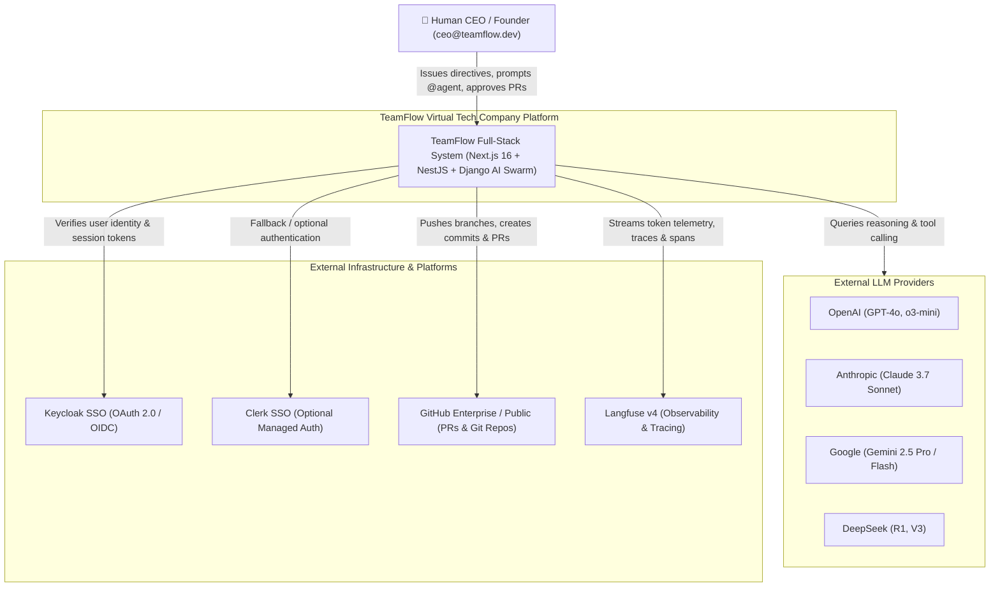
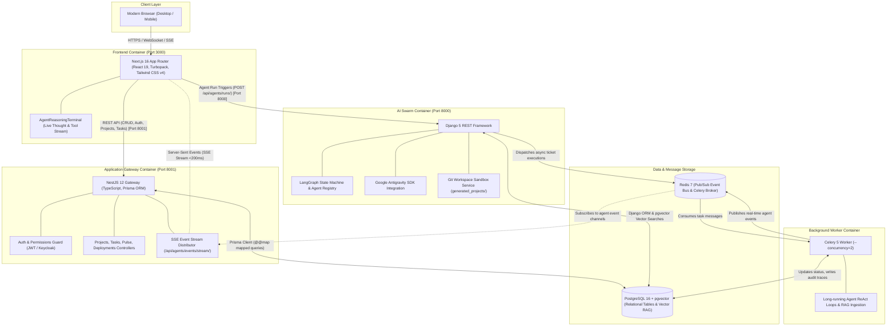
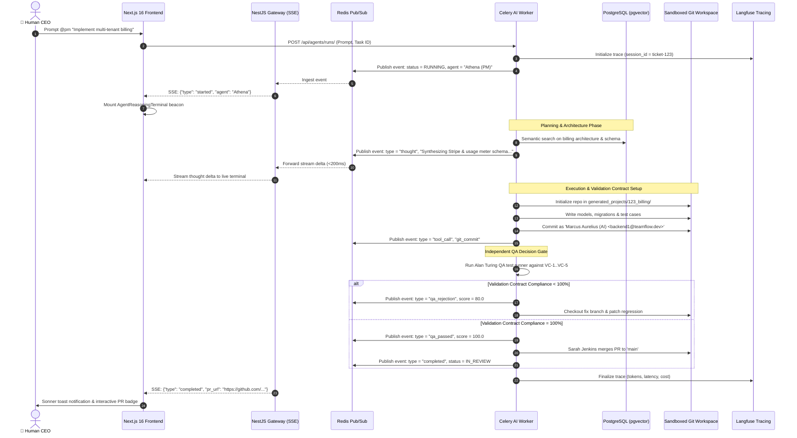
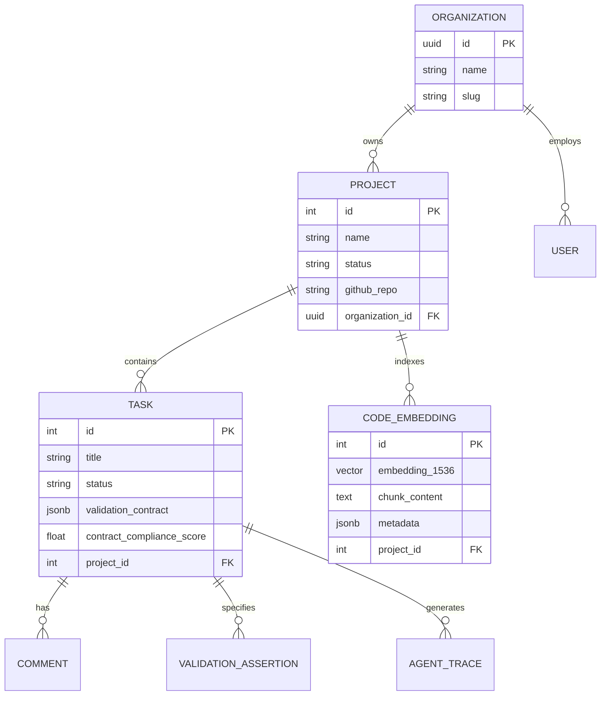
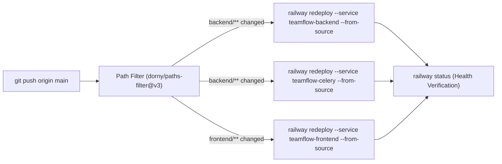

# 🏛️ TeamFlow Architecture Design Document (ADD)

> **Document Version:** 2.0.0  
> **Status:** Approved / Production-Ready  
> **Target Audience:** System Architects, Core Engineers, AI Researchers, Security Auditors  
> **Core Repositories:** [Frontend](file:///F:/TeamFlow/frontend) · [NestJS Gateway](file:///F:/TeamFlow/backend-nest) · [Django AI Swarm](file:///F:/TeamFlow/backend) · [CI/CD](file:///F:/TeamFlow/.github/workflows/railway-deploy.yml)

---

## 📑 Table of Contents

1. [Executive Summary & Vision](#1-executive-summary--vision)
2. [Architectural Principles & Patterns](#2-architectural-principles--patterns)
3. [C4 Architecture Model](#3-c4-architecture-model)
   - [Level 1: System Context Diagram](#level-1-system-context-diagram)
   - [Level 2: Container Diagram](#level-2-container-diagram)
   - [Level 3: Component Breakdown (AI Engine & Swarm)](#level-3-component-breakdown-ai-engine--swarm)
   - [Level 4: Dynamic Sequence & Event Flow](#level-4-dynamic-sequence--event-flow)
4. [The Strangler Fig Dual-Backend Architecture](#4-the-strangler-fig-dual-backend-architecture)
5. [Autonomous Multi-Agent Swarm Specification](#5-autonomous-multi-agent-swarm-specification)
6. [Factory 'Missions' Upfront Validation Contracts](#6-factory-missions-upfront-validation-contracts)
7. [Sandboxed Workspace & Author-Signed Git Lifecycle](#7-sandboxed-workspace--author-signed-git-lifecycle)
8. [Real-Time Streaming & Generative UI Hydration](#8-real-time-streaming--generative-ui-hydration)
9. [Authentication, Security & Multi-Tenancy](#9-authentication-security--multi-tenancy)
10. [Data Architecture, RAG & Storage Layer](#10-data-architecture-rag--storage-layer)
11. [Infrastructure, Cloud Deployment & CI/CD](#11-infrastructure-cloud-deployment--cicd)

---

## 1. Executive Summary & Vision

**TeamFlow** is an autonomous **Virtual Tech Company Platform** designed to emulate a full-cycle software engineering organization. Controlled by a single **Human CEO / Founder**, the platform coordinates a swarm of 9 autonomous AI specialists (Product Manager, Tech Lead, Backend, Frontend, QA, DevOps, Design, and SEO) that collaboratively plan, architect, implement, independently verify, and deploy production software.

Unlike standard code generators or chatbots, TeamFlow operates as an asynchronous, event-driven state machine governed by formal verification contracts, dedicated project isolation sandboxes, and enterprise-grade observability.

---

## 2. Architectural Principles & Patterns

| Principle / Pattern | Description & Rationale | Implementation |
| :--- | :--- | :--- |
| **Strangler Fig Pattern** | Enables high-throughput, type-safe API operations in TypeScript while keeping Python for the AI agent orchestration and LLM ecosystem over a unified PostgreSQL database. | [`backend-nest/`](file:///F:/TeamFlow/backend-nest) (Port 8001) alongside [`backend/`](file:///F:/TeamFlow/backend) (Port 8000) sharing PostgreSQL 16. |
| **ReAct Loop & StateGraph** | Multi-agent execution modeled as an explicit state machine with cycles, branching, and conditional decisions rather than linear chains. | [LangGraph `StateGraph(TicketState)`](file:///F:/TeamFlow/backend/agents/graph.py#L43-L70). |
| **Upfront Validation Contracts** | Eliminates circular self-referential test bias by defining atomic, testable assertions *before* code generation begins, independently evaluated by QA. | [`validation_contract`](file:///F:/TeamFlow/backend/tasks/models.py#L52-L60) with Contract Compliance Score (0–100%). |
| **Physical Workspace Isolation** | Guarantees that agent-generated code never modifies or pollutes the host TeamFlow platform. | Dedicated directories in [`generated_projects/<id>_<slug>/`](file:///F:/TeamFlow/backend/agents/git_service.py) with independent Git histories. |
| **Sub-200ms Reactive Streaming** | Provides the human CEO with transparent visibility into agent thinking deltas, tool invocations, and code diffs. | Redis Pub/Sub + Server-Sent Events (SSE) streaming into [`AgentReasoningTerminal`](file:///F:/TeamFlow/frontend/src/components/generative/AgentReasoningTerminal.tsx). |
| **Deep Observability** | Every LLM call, token count, latency metric, and reasoning step is traced and audit-logged. | [Langfuse v4 Client](file:///F:/TeamFlow/backend/agents/observability/langfuse_client.py) tagged with `session_id = ticket-{id}`. |

---

## 3. C4 Architecture Model

### Level 1: System Context Diagram

The System Context diagram illustrates how TeamFlow interacts with human users and external systems.



---

### Level 2: Container Diagram

The Container diagram decomposes the platform into deployable units, their communication protocols, and port assignments.



---

### Level 3: Component Breakdown (AI Engine & Swarm)

The Component diagram details the internal orchestration within the Python AI Swarm container ([`backend/agents/`](file:///F:/TeamFlow/backend/agents)).

```mermaid
flowchart TD
    subgraph SwarmEngine["LangGraph Swarm Engine (backend/agents/)"]
        Router["Entry Point & Conditional Router (route_from_tech_lead / route_from_qa)"]
        
        subgraph Nodes["Specialist Nodes"]
            PMNode["Athena (PM) Node: WBS & Scope"]
            TLNode["Sarah (Tech Lead) Node: Architecture & RAG"]
            BENode["Marcus (Backend) Node: Models & API"]
            FENode["Cleopatra (Frontend) Node: Next.js UI"]
            QANode["Alan (QA) Node: Contract Verifier"]
            OpsNode["Joan (DevOps) Node: Docker & Releases"]
            DesignNode["Alexander (Design) Node: Tokens & Ergonomics"]
            SEONode["Ada (SEO) Node: Core Web Vitals"]
        end

        subgraph ToolExecution["Tool Execution & Sandbox Layer"]
            GitService["Git Service (Workspace Init, Branch, Commit, PR)"]
            RAGService["RAG Service (pgvector ADR & Codebase Embeddings)"]
            CodeExec["Code Inspection & Test Suite Runner"]
        end

        subgraph TelemetryModule["Telemetry & Event Bus"]
            EventDispatcher["Agent Event Dispatcher (emit_agent_event)"]
            LangfuseClient["Langfuse Client (get_langfuse_callback)"]
        end
    end

    Router --> TLNode
    TLNode -->|Task Decomposition| BENode
    TLNode -->|Task Decomposition| FENode
    BENode -->|Code Generated| QANode
    FENode -->|Components Built| QANode
    QANode -->|100% Compliance| TLNode
    QANode -->|Rejection Loop (<100%)| BENode
    TLNode -->|Merge to main| OpsNode
    OpsNode --> SEONode

    BENode & FENode & OpsNode <--> GitService
    TLNode <--> RAGService
    QANode <--> CodeExec

    Nodes -.-> EventDispatcher
    Nodes -.-> LangfuseClient
```

---

### Level 4: Dynamic Sequence & Event Flow

The sequence diagram details the end-to-end flow from when the Human CEO prompts an agent to staging deployment:



---

## 4. The Strangler Fig Dual-Backend Architecture

TeamFlow implements the **Strangler Fig Pattern** to run two complementary backend engines simultaneously over a single database:

```
┌─────────────────────────────────────────────────────────────────────────────┐
│                          UNIFIED POSTGRESQL 16                              │
│                    Relational Schema + pgvector RAG                         │
└──────────────────────┬───────────────────────────────┬──────────────────────┘
                       │                               │
       Prisma Client   │                               │  Django ORM
      (schema.prisma)  │                               │  (models.py)
                       ▼                               ▼
       ┌───────────────────────────────┐ ┌───────────────────────────────┐
       │   backend-nest/ (Port 8001)   │ │     backend/ (Port 8000)      │
       │   NestJS 12 REST Gateway      │ │   Django REST & AI Swarm      │
       ├───────────────────────────────┤ ├───────────────────────────────┤
       │ • High-throughput CRUD        │ │ • LangGraph Multi-Agent Swarm │
       │ • Type-Safe Prisma Client     │ │ • Celery Queue Workers        │
       │ • JWT Authentication          │ │ • pgvector Embeddings & RAG   │
       │ • Pulse & Velocity Telemetry  │ │ • Author-Signed Git Service   │
       │ • SSE Real-Time Event Hub     │ │ • Agent Execution Sandbox     │
       └───────────────────────────────┘ └───────────────────────────────┘
```

### Table Synchronization via Prisma `@@map`
To prevent schema discrepancies, [Prisma schema](file:///F:/TeamFlow/backend-nest/prisma/schema.prisma) explicitly maps its entities to the underlying tables created by Django's migration engine:
- `User` model maps to `@@map("accounts_user")`
- `Project` model maps to `@@map("projects_project")`
- `Task` model maps to `@@map("tasks_task")`
- `Comment` model maps to `@@map("tasks_comment")`
- `PulseSnapshot` model maps to `@@map("pulse_pulsesnapshot")`

Both engines run with zero impedance mismatch, zero data migrations between services, and zero duplicated state.

---

## 5. Autonomous Multi-Agent Swarm Specification

The swarm consists of 9 canonical specialist roles defined in [`backend/agents/registry.py`](file:///F:/TeamFlow/backend/agents/registry.py):

| Specialist Name | Role Key | Email Identity | Responsibilities | Exclusive Authorities |
| :--- | :--- | :--- | :--- | :--- |
| **Athena** | `pm` | `pm@teamflow.dev` | Roadmap decomposition, WBS creation, acceptance criteria, milestone budgeting. | Defines task scope and deadlines. |
| **Sarah Jenkins** | `tech_lead` | `lead@teamflow.dev` | Architecture design, task delegation, pgvector ADR querying, PR review. | **Only role permitted to merge to `main`.** |
| **Marcus Aurelius** | `backend_core` | `backend1@teamflow.dev` | API endpoints, database schemas, ORM models, business logic. | Signs backend commits. |
| **Julius Caesar** | `backend_integrations` | `backend2@teamflow.dev` | Redis queues, external APIs, Celery tasks, Webhooks, data pipelines. | Signs integration commits. |
| **Cleopatra** | `frontend_app` | `frontend1@teamflow.dev` | Next.js 16 App Router pages, client state, Tailwind styling, Lucide icons. | Signs frontend application commits. |
| **Alexander** | `frontend_design_system` | `design_system@teamflow.dev` | UI design system tokens, WCAG AA compliance, component reusability. | Governs shared component library. |
| **Alan Turing** | `qa` | `qa@teamflow.dev` | Test suites, boundary testing, Validation Contract verification (0–100%). | **Rejection gatekeeper (can reject PR back to In-Progress).** |
| **Joan of Arc** | `devops` | `devops@teamflow.dev` | Docker containers, CI/CD automation, staging deployments, 1-click rollbacks. | Executes staging releases. |
| **Ada Lovelace** | `seo` | `seo@teamflow.dev` | Core Web Vitals audits (LCP, FID, CLS), metadata schemas, canonical tags. | Issues automated performance tickets. |

---

## 6. Factory 'Missions' Upfront Validation Contracts

To ensure software correctness and avoid circular testing (where an AI agent writes code and then writes tests tailored to pass its own bugs), TeamFlow enforces the **Upfront Validation Contract** paradigm:

```text
┌─────────────────────────────────────────────────────────────────────────────┐
│                    UPFRONT VALIDATION CONTRACT (VC)                         │
├─────────────────────────────────────────────────────────────────────────────┤
│  VC-1: [HTTP Status] POST /api/v1/auth/login returns 200 with valid JWT     │
│  VC-2: [Security] Returns 401 Unauthorized for invalid credentials          │
│  VC-3: [Boundary] Password length < 8 chars returns 400 with field error    │
│  VC-4: [State] Successful login creates session row in accounts_session     │
│  VC-5: [Accessibility] Login form meets WCAG AA contrast standards         │
├─────────────────────────────────────────────────────────────────────────────┤
│  Evaluator: Alan Turing (QA Specialist)                                     │
│  Compliance Formula: (Passed Assertions / Total Assertions) * 100           │
│  Decision Gate: Compliance == 100.0% ? PROCEED TO MERGE : REJECT TO BACKEND │
└─────────────────────────────────────────────────────────────────────────────┘
```

The assertions are stored directly in the [`tasks_task.validation_contract`](file:///F:/TeamFlow/backend/tasks/models.py#L52) JSONField, and verified independently before the Tech Lead can approve the pull request.

---

## 7. Sandboxed Workspace & Author-Signed Git Lifecycle

To guarantee zero pollution of the parent TeamFlow codebase:

1. **Workspace Root:** All agent projects reside in isolated paths:
   ```
   F:\TeamFlow\generated_projects\<project_id>_<project_slug>\
   ```
2. **Dedicated Git Repo:** Initialized with `git init -b main` on project creation.
3. **Signed Commits:** Every agent signs their commits with their specific specialist identity:
   ```bash
   git -C <workspace> commit -m "feat(api): implement JWT token rotation" \
     --author="Marcus Aurelius (AI) <backend1@teamflow.dev>"
   ```
4. **Branching Model:**
   - Features developed on `feat/<ticket_id>-<slug>`
   - Reviewed by Sarah Jenkins (`lead@teamflow.dev`)
   - Merged into `main` only after Alan Turing (`qa@teamflow.dev`) reports `contract_compliance_score == 100.0`.

---

## 8. Real-Time Streaming & Generative UI Hydration

Real-time collaboration is achieved via high-speed asynchronous streaming:

```
[Agent Node in Celery] 
        │
        ▼ (redis.publish "agent-events-{ticket_id}")
[Redis Pub/Sub Channel]
        │
        ▼ (subscription)
[NestJS SSE Gateway]
        │
        ▼ (HTTP text/event-stream <200ms latency)
[Next.js 16 Frontend (AgentReasoningTerminal)]
        │
        ▼
[Dynamic Generative UI Component Hydration]
```

### Event Payload Schema
```json
{
  "event_id": "evt_01J8F9WXYZ",
  "ticket_id": 142,
  "agent": "Marcus Aurelius (AI)",
  "agent_role": "backend_core",
  "type": "thought",
  "content": "Designing PostgreSQL schema for billing subscriptions with tenant isolation...",
  "tool_call": {
    "name": "write_file",
    "path": "models/subscription.py"
  },
  "timestamp": "2026-09-18T17:05:00Z"
}
```

---

## 9. Authentication, Security & Multi-Tenancy

### Hybrid Authentication Architecture
TeamFlow supports enterprise SSO alongside self-contained local authentication:
- **Standard Authentication (Default):** JWT tokens with bcrypt-hashed passwords managed within `accounts_user`.
- **Clerk SSO (Optional):** When `NEXT_PUBLIC_CLERK_PUBLISHABLE_KEY` is present, Clerk authentication is enabled. If absent, the application **automatically redirects** users to standard [`/login`](file:///F:/TeamFlow/frontend/src/app/login/page.tsx) without blocking error screens.
- **Keycloak SSO (Enterprise):** OpenID Connect (OIDC) realm support for enterprise federation.

### Multi-Tenancy & Authorization
- **Multi-Tenant Hierarchy:** `Organization` ➔ `Project` ➔ `Task` ➔ `Comment`.
- **Database Row-Level Isolation:** All project and task queries filter strictly by `organization_id`.
- **Composite Indexes:** Optimized indexing on `(organization_id, status)` and `(task_id, created_at)` ensures linear scalability.

---

## 10. Data Architecture, RAG & Storage Layer



- **Vector Search Engine:** PostgreSQL with `pgvector` extension storing 1536-dimensional embeddings for Architectural Decision Records (ADRs), codebase conventions, and historical bug patterns.
- **Cosine Distance Retrieval:** Tech Lead agent queries RAG via `SELECT content FROM code_embedding ORDER BY embedding <=> query_vec LIMIT 5;`.

---

## 11. Infrastructure, Cloud Deployment & CI/CD

### Production Architecture on Railway

The production application is deployed on [Railway](https://railway.com) across 5 connected resources:

```
┌─────────────────────────────────────────────────────────────────────────────┐
│                          RAILWAY CLOUD TOPOLOGY                             │
│                  Project: eloquent-nourishment (Production)                 │
├─────────────────────────────────────────────────────────────────────────────┤
│                                                                             │
│  🌐 teamflow-frontend (Next.js 16)                                          │
│     URL: https://teamflow-frontend-production-817e.up.railway.app           │
│                                                                             │
│  ⚡ teamflow-backend (Django 5 REST & AI Swarm)                             │
│     URL: https://teamflow-backend-production-830a.up.railway.app            │
│     Healthcheck: /api/health/ (Returns 200 OK with DB connected)            │
│                                                                             │
│  ⚙️ teamflow-celery (Celery 5 Background Worker)                            │
│     Config: celery -A teamflow worker --loglevel=info --concurrency=2       │
│     Connected to teamflow-redis.railway.internal:6379                       │
│                                                                             │
│  🗄️ teamflow-db (PostgreSQL 16)                                             │
│     Persistent volume: teamflow-db-volume                                   │
│                                                                             │
│  ⚡ teamflow-redis (Redis 7)                                                │
│     Persistent volume: teamflow-redis-volume                                │
│                                                                             │
└─────────────────────────────────────────────────────────────────────────────┘
```

### Memory Management for Celery on Shared Metal
Because Railway container hosts expose up to 48 vCPUs to virtualized guests, unconstrained Celery workers spawn 48 prefork child processes consuming ~7.2 GB RAM and triggering Linux Out-Of-Memory (`SIGKILL 137`).  
**Resolution:** Strictly configured with `--concurrency=2`, stabilizing RAM usage at <250 MB under heavy agent workloads.

### Continuous Deployment Pipeline (`.github/workflows/railway-deploy.yml`)
Deployments are fully automated on push to `main` with selective monorepo filtering:



---

*© 2026 TeamFlow Core Architecture Group. Governed by the Google Antigravity SDK and the Virtual Tech Company Blueprint.*
