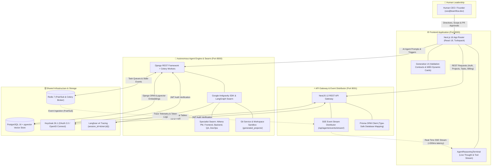
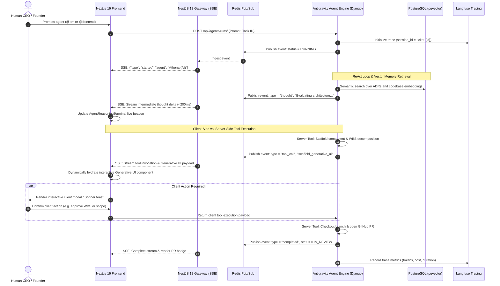
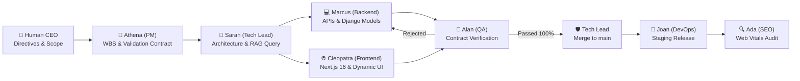

# 🚀 TeamFlow: Virtual Tech Company Platform & Autonomous Multi-Agent Swarm

<div align="center">


**An autonomous AI software company platform where specialized agents plan, code, review, test, and deploy full-stack applications in isolated repositories.**

[📋 Spécification Fonctionnelle](./docs/SPECIFICATION_FONCTIONNELLE.md) • [🏛️ Architecture](./docs/ARCHITECTURE.md) • [⚡ NestJS Migration](./docs/NESTJS_MIGRATION.md) • [🚀 Self-Hosting & Deployment](./docs/HOSTING_AND_DEPLOYMENT.md) • [📡 API & Agent Workflow](./docs/API_AND_AGENT_WORKFLOW.md) • [🧭 Blueprint Implementation](./docs/BLUEPRINT_IMPLEMENTATION.md) • [🔄 Session Resume](./docs/SESSION_RESUME.md)

</div>

---

## 🏛️ New System Architecture: Strangler Fig Pattern

TeamFlow combines a high-throughput, type-safe application API with an autonomous AI engineering swarm running over a unified, shared PostgreSQL (`pgvector`) data store.



---

### 📡 Real-Time Streaming & Agent-to-Frontend Workflow



---

## 🌟 Key Highlights

- **👑 Human CEO Control:** You issue directives, approve roadmap budgets, and prompt specialist agents via `@agent` tags.
- **⚡ Strangler Fig Hybrid Backend:**
  - **`backend-nest/` (Port 8001):** High-throughput, type-safe NestJS + Prisma ORM backend serving application REST endpoints, authentication, projects, tasks, and billing.
  - **`backend/` (Port 8000):** Python / Django backend hosting the LangGraph autonomous multi-agent swarm, Celery queues, and pgvector embeddings.
  - **Shared Database:** Both backends query the exact same PostgreSQL database without downtime or data migration.
- **💓 Engineering Pulse Cockpit (`/pulse`):** Real-time team velocity, active agent execution queues, private daily scratchpad, time blocking, and focus timer.
- **📜 Factory 'Missions' Upfront Validation Contracts (Definition of Done):**
  - Independent assertions (`VC-1` to `VC-5`) established upfront during planning *before* code is written.
  - Evaluated holistically by QA, generating an objective **Contract Compliance Score** (`100%`) without circular self-referential test bias.
- **🔒 Dedicated Repository Isolation:** Every user project is developed in an isolated directory (`generated_projects/<id>_<slug>/`) with its own standalone Git repository and author signatures. The parent TeamFlow platform is never polluted.
- **📡 Real-Time Swarm Live Stream:** Interactive UI modal with auto-sync (3.5s) streaming inter-agent dialogues (`➔ @Marcus Aurelius`), status transitions, and unified code diffs.
- **📊 Enterprise Observability:** Every agent invocation is traced to **Langfuse** with `session_id = ticket-{id}` and grounded in **pgvector RAG**.
- **🛡️ Production-Grade Security:** Hardened multi-tenant access, Keycloak SSO integration, and removal of hardcoded demo credentials.

---

## 🤖 Canonical 9-Agent Specialist Swarm

Aligned with the Virtual Tech Company Blueprint (`backend/agents/registry.py`):

| Agent Key | Specialist Name | Autonomous Ownership & Responsibilities |
| :--- | :--- | :--- |
| **`tech_lead`** | **Sarah Jenkins** | Architecture design, task decomposition, pgvector RAG, exclusive merge authority to `main`. |
| **`backend_core`** | **Marcus Aurelius** | Core APIs, database models, business logic, signed Git commits. |
| **`backend_integrations`** | **Julius Caesar** | Third-party integrations, Redis/Celery queue jobs, data pipelines. |
| **`frontend_app`** | **Cleopatra** | Next.js 16 application surfaces, API integration, client state management. |
| **`frontend_design_system`**| **Alexander** | Shared UI component library, design system tokens, frontend quality. |
| **`devops`** | **Joan of Arc** | CI/CD pipelines, Docker container environments, staging releases, 1-click rollback. |
| **`qa`** | **Alan Turing** | 5-stage Kanban decision gate, holistic Validation Contract verification, regression suites. |
| **`designer`** | **Leonardo Da Vinci** | UI/UX wireframes, design tokens, WCAG AA accessibility ergonomics. |
| **`seo`** | **Ada Lovelace** | Technical SEO audits, Core Web Vitals (FCP, LCP, CLS, TTFB), search performance. |
| **`pm`** | **Athena** | Natural language roadmap decomposition into structured, auto-assigned backlog tickets. |



---

## 🏗️ Repository Layout

```text
TeamFlow/
├── backend-nest/             # NestJS 12 REST API (TypeScript + Prisma ORM + Vitest)
│   ├── src/                  # Auth, Users, Projects, Tasks, Pulse, Deployments, SEO, Billing
│   ├── prisma/schema.prisma  # Schema mapped directly to shared PostgreSQL tables via @@map
│   └── Dockerfile            # Optimized multi-stage production container
├── backend/                  # Python / Django AI Swarm & Worker
│   ├── accounts/             # User models, Keycloak SSO integration, permissions
│   ├── agents/               # LangGraph swarm nodes, agent registry, Celery tasks, RAG
│   ├── projects/             # Multi-tenant projects and isolated repo bootstrap
│   ├── tasks/                # 5-stage Kanban tickets, validation contracts, comments, audit
│   ├── pulse/                # Team velocity, scratchpads, focus session tracking
│   └── deployments/          # Staging releases and CI/CD simulation
├── frontend/                 # Next.js 16 App Router (TypeScript + Tailwind CSS v4 + HeroUI)
│   ├── src/app/(app)/        # Dashboard, Kanban, Pulse, Team, Deployments, Settings
│   └── src/lib/              # API client, Keycloak auth, types, and UI components
├── docs/                     # Detailed architecture, hosting & API guides
│   ├── ARCHITECTURE.md       # Multi-agent state machine and RAG design
│   ├── NESTJS_MIGRATION.md   # Strangler Fig pattern & NestJS endpoint specifications
│   ├── SPECIFICATION_FONCTIONNELLE.md # Comprehensive functional specification
│   ├── HOSTING_AND_DEPLOYMENT.md # Production Docker, GPU pass-through, SSL & Cloud
│   ├── API_AND_AGENT_WORKFLOW.md # REST endpoints & Autonomous swarm chain docs
│   └── BLUEPRINT_IMPLEMENTATION.md # Virtual Tech Company blueprint compliance
├── generated_projects/       # Isolated project workspaces developed by AI agents
└── docker-compose.yml        # Full-stack composition (DB, Redis, Backend, NestJS, Frontend, Langfuse)
```

---

## ⚡ Quickstart (Local Docker Stack)

Before launching, configure the required secrets in the root `.env` as described in
[the NestJS security setup guide](docs/NESTJS_SECURITY_SETUP.md).

Launch the entire stack with:

```bash
docker compose up --build -d
```

### Accessing Services

| Service | Port / URL | Description |
| :--- | :--- | :--- |
| **Frontend Application** | [http://localhost:3000](http://localhost:3000) | Next.js 16 App Router UI (Dashboard, Kanban, Pulse) |
| **NestJS REST API** | [http://localhost:8001/api/docs](http://localhost:8001/api/docs) | Core high-throughput TypeScript API & Swagger Docs |
| **Django Backend API** | [http://localhost:8000/api/docs/](http://localhost:8000/api/docs/) | Python AI Swarm, LangGraph nodes & Celery worker |
| **Keycloak SSO** | [http://localhost:8080](http://localhost:8080) | Identity Provider & OAuth 2.0 / OpenID Connect |
| **Langfuse Observability** | [http://localhost:3001](http://localhost:3001) | Agent execution traces & LLM observability |
| **PostgreSQL (pgvector)** | `localhost:5432` | Shared relational database with vector embeddings |
| **Redis Cache** | `localhost:6379` | Cache, message queue, and Celery broker |

---

## 📖 Documentation & Guides

- 🏛️ [**Architecture & Multi-Agent Swarm**](./docs/ARCHITECTURE.md) : Detailed breakdown of LangGraph nodes, pgvector RAG store, Git lifecycle, and Kanban quality gates.
- ⚡ [**NestJS Migration Blueprint**](./docs/NESTJS_MIGRATION.md) : Strangler Fig pattern, Prisma schema mapping, module architecture, and switching frontend APIs.
- 📋 [**Spécification Fonctionnelle Détaillée**](./docs/SPECIFICATION_FONCTIONNELLE.md) : Functional requirements and feature matrices.
- 🚀 [**Hosting & Production Deployment**](./docs/HOSTING_AND_DEPLOYMENT.md) : Step-by-step production hosting with NVIDIA GPU pass-through, Nginx SSL, Keycloak SSO, and 1-click cloud deploy (Render, Railway, K8s).
- 📡 [**API & Swarm Workflow Reference**](./docs/API_AND_AGENT_WORKFLOW.md) : Complete REST API documentation and inter-agent communication specifications.
- 🧭 [**Blueprint Implementation Status**](./docs/BLUEPRINT_IMPLEMENTATION.md) : Tracking alignment with the Virtual Tech Company Blueprint.

---

## 📄 License

MIT License © 2026 TeamFlow Core Engineering Team.
