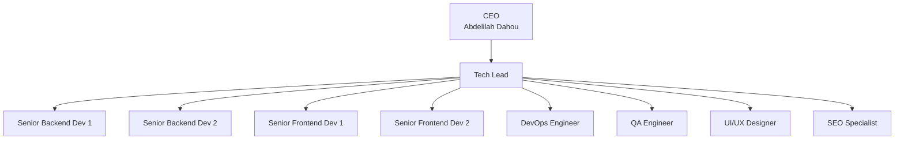
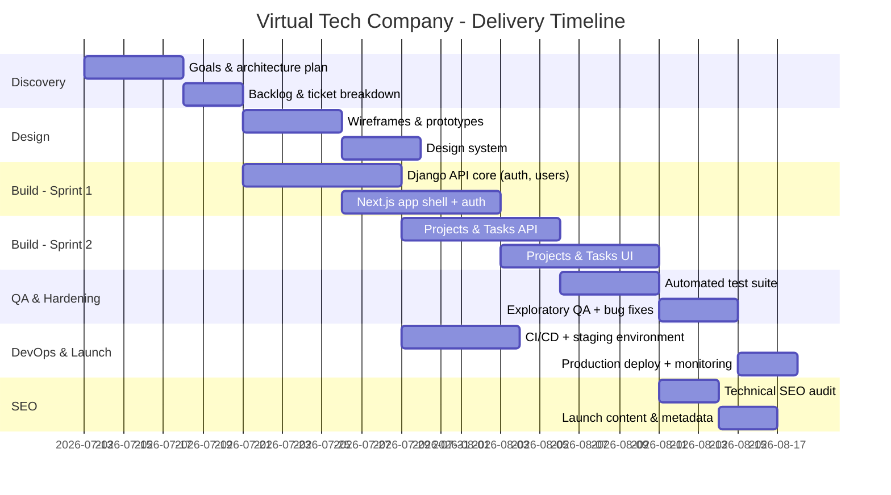
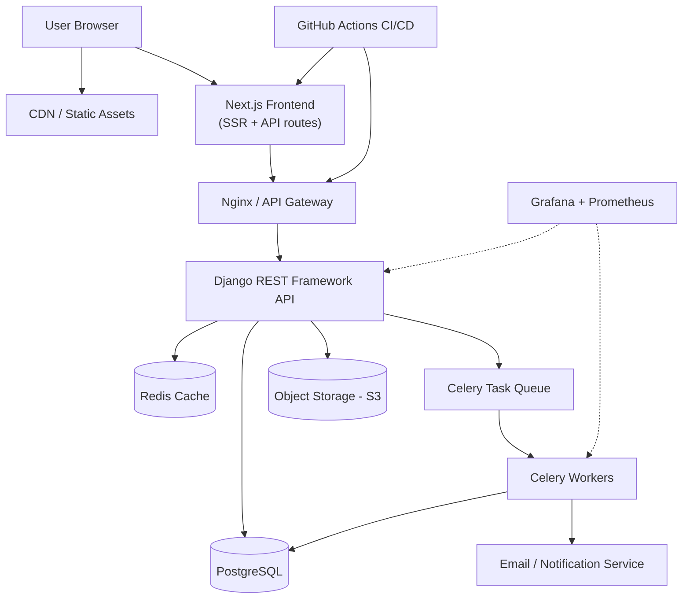

# 🏢 Virtual Tech Company Blueprint

**CEO:** Abdelilah Dahou

An AI-agent engineering team orchestrated with the Google Antigravity SDK. Every seat below (except the CEO) is filled by an autonomous agent with a scoped role, tools, and reporting line.

---

## Organigram



## Team Structure

| Role | Count | Reports To | Core Responsibility |
|---|---|---|---|
| CEO | 1 | — | Sets company vision, approves budget and releases |
| Tech Lead | 1 | CEO | Architecture, sprint planning, code-review gate, coordinates all agents |
| Senior Backend Developer | 2 | Tech Lead | API design, database/services, business logic, backend security |
| Senior Frontend Developer | 2 | Tech Lead | UI implementation, state management, client performance, accessibility |
| DevOps Engineer | 1 | Tech Lead | CI/CD, infrastructure-as-code, environments, monitoring, releases |
| QA Engineer | 1 | Tech Lead | Test strategy, automated + exploratory testing, release sign-off |
| UI/UX Designer | 1 | Tech Lead | Wireframes, prototypes, design system, usability validation |
| SEO Specialist | 1 | Tech Lead | Technical SEO, content structure, keyword strategy, search analytics |

## Reporting & Orchestration Model

- **CEO (Abdelilah Dahou)** → sets goals, priorities, approves releases and budget.
- **Tech Lead Agent** → breaks goals into tickets, assigns them, reviews pull requests, resolves technical conflicts, reports status to the CEO.
- **Senior Backend Agents (×2)** → implement services/APIs; split by domain (e.g. core API vs. data/integrations).
- **Senior Frontend Agents (×2)** → implement UI; split by surface (e.g. web app vs. marketing site/design system).
- **DevOps Agent** → owns CI/CD pipelines, infra-as-code, environments, production monitoring.
- **QA Agent** → writes and runs automated tests, performs exploratory testing, files and verifies bug fixes.
- **UI/UX Agent** → produces wireframes/prototypes and a shared design system consumed by frontend agents.
- **SEO Agent** → audits technical SEO, defines content/keyword strategy, reviews releases for search impact.

All agents share a common task board so state is visible across the team instead of trapped in individual chat sessions.

---

## Role Profiles

### Tech Lead
**Mission:** Owns the technical roadmap and is the single point of coordination between the CEO and the rest of the virtual team.

**Responsibilities**
- Translate company goals into an architecture plan and a prioritized backlog
- Split backlog items into tickets scoped for a single agent
- Review all pull requests before merge; enforce coding standards
- Resolve cross-team technical decisions
- Run a daily/async standup pulling status from every agent
- Escalate ambiguous or high-risk decisions to the CEO

**Sample Antigravity System Instruction**
```
You are the Tech Lead of a virtual software company reporting to
CEO Abdelilah Dahou. Translate company goals into an architecture
plan, create scoped tickets for backend, frontend, DevOps, QA,
design and SEO agents, review their pull requests, and enforce
consistent standards. Never merge code you have not reviewed.
Escalate to the CEO when a decision affects budget, timeline, or
irreversible infrastructure changes.
```

### Senior Backend Developer (×2)
**Mission:** Builds and maintains server-side systems: APIs, business logic, data storage, integrations.

**Responsibilities**
- Design and implement REST/GraphQL APIs from Tech Lead specs
- Own database schema, migrations, query performance
- Write unit and integration tests
- Handle authentication, authorization, data security
- Document APIs for frontend consumption
- Split by domain: Agent A = core product API, Agent B = integrations/data pipeline

**Stack:** Django + Django REST Framework, PostgreSQL, Redis, Celery for background jobs

### Senior Frontend Developer (×2)
**Mission:** Builds the user-facing application(s), consuming backend APIs and the design system.

**Responsibilities**
- Implement UI components/pages per design specs
- Manage client-side state, routing, performance
- Ensure accessibility and cross-browser support
- Integrate with backend APIs, handle error/loading states
- Split by surface: Agent A = core web app, Agent B = marketing site/design-system components

**Stack:** Next.js (React), TypeScript, Tailwind CSS

### DevOps Engineer
**Mission:** Keeps environments, pipelines, and production infrastructure reliable and reproducible.

**Responsibilities**
- Maintain CI/CD pipelines
- Manage infrastructure as code across dev/staging/prod
- Configure monitoring, logging, alerting
- Own release process, rollbacks, incident response
- Manage secrets and access control

### QA Engineer
**Mission:** Guards product quality by testing every change before and after release.

**Responsibilities**
- Write and maintain automated test suites
- Perform exploratory testing on new features
- Triage, reproduce, and file bugs
- Sign off on releases against a defined quality bar

### UI/UX Designer
**Mission:** Defines how the product looks, feels, and behaves.

**Responsibilities**
- Produce wireframes and interactive prototypes
- Maintain a shared design system
- Run lightweight usability checks
- Hand off specs to frontend agents

### SEO Specialist
**Mission:** Ensures the product is discoverable and performs well in search.

**Responsibilities**
- Audit technical SEO (speed, metadata, structured data, crawlability)
- Define keyword and content strategy
- Review new pages/releases for SEO impact before launch
- Track rankings and organic traffic, report trends

---

## Suggested Tech Stack

- Orchestration: Google Antigravity SDK / Agent Manager
- Backend: **Django** + Django REST Framework, PostgreSQL, Redis, Celery (async tasks)
- Frontend: **Next.js** (React), TypeScript, Tailwind CSS
- CI/CD: GitHub Actions
- Infra as code: Terraform
- Monitoring: Grafana + Prometheus
- Planning board: Linear, Notion, or GitHub Projects
- Design: Figma

## Governance

- CEO Abdelilah Dahou approves scope changes, budget decisions, and production releases at key milestones
- Tech Lead escalates (never decides alone) on irreversible infra changes, spending above threshold, security-sensitive changes
- Full audit log of every agent's tool calls and merged pull requests
- Periodic human review spot-checks to calibrate trust in each agent

---

## Project Timeline

> Assumption: since no specific product was named, this timeline and the System Design / API sections below scaffold the team's first build — an internal Ticketing / Project Management platform (the same shared task board the agents use to coordinate). Swap in your real product scope and the dates/endpoints adjust accordingly.



| Phase | Duration | Owner(s) | Goal of the Week | Output |
|---|---|---|---|---|
| Discovery | Week 1 | Tech Lead, CEO | Align on scope and lock the architecture so every agent can start from the same plan | Architecture plan, prioritized backlog |
| Design | Week 1–2 | UI/UX Designer | Get wireframes and a reusable design system approved before any UI is built | Wireframes, prototypes, design system |
| Sprint 1 — Foundations | Week 2–3 | Backend 1, Frontend 1 | Ship working auth end-to-end (API + UI) so every later feature can build on real accounts | Auth, user management (API + UI) |
| Sprint 2 — Core Features | Week 3–4 | Backend 2, Frontend 2 | Deliver the core Projects & Tasks flow as a usable, demoable feature | Projects & Tasks (API + UI) |
| QA & Hardening | Week 4–5 | QA Engineer | Drive the app to a releasable quality bar — no critical/high bugs open | Test coverage, bug fixes, sign-off |
| DevOps & Launch | Week 3–5 (parallel) | DevOps Engineer | Have CI/CD and staging ready before QA sign-off, then ship to production | CI/CD, staging, production deploy |
| SEO & Launch Content | Week 5 | SEO Specialist | Make sure launched pages are crawlable, indexed, and correctly tagged on day one | Technical audit, launch metadata |

---

## System Design



**Components**
- **Next.js frontend** — SSR pages, client-side routing, calls the Django API over HTTPS; hosted behind a CDN for static assets.
- **Nginx / API Gateway** — TLS termination, routing, rate limiting.
- **Django REST Framework API** — business logic, auth (JWT or session), serializers/viewsets per resource.
- **PostgreSQL** — primary datastore (users, projects, tasks, tickets).
- **Redis** — caching + Celery broker.
- **Celery workers** — async jobs: emails, report generation, SEO audits, webhook delivery.
- **Object storage (S3-compatible)** — file/image uploads.
- **Grafana + Prometheus** — metrics, dashboards, alerting owned by DevOps.
- **GitHub Actions** — CI (lint/test) and CD (build/deploy) for both Django and Next.js apps.

---

## API Design (Django REST Framework)

### Auth

| Method | Endpoint | Description |
|---|---|---|
| POST | `/api/auth/register/` | Create a new user account |
| POST | `/api/auth/login/` | Obtain JWT access/refresh tokens |
| POST | `/api/auth/refresh/` | Refresh access token |
| POST | `/api/auth/logout/` | Invalidate refresh token |
| GET | `/api/auth/me/` | Get current authenticated user |

### Users

| Method | Endpoint | Description |
|---|---|---|
| GET | `/api/users/` | List users (admin/Tech Lead only) |
| GET | `/api/users/{id}/` | Retrieve a user |
| PATCH | `/api/users/{id}/` | Update user profile/role |
| DELETE | `/api/users/{id}/` | Deactivate a user |

### Projects

| Method | Endpoint | Description |
|---|---|---|
| GET | `/api/projects/` | List projects |
| POST | `/api/projects/` | Create a project |
| GET | `/api/projects/{id}/` | Retrieve project detail |
| PATCH | `/api/projects/{id}/` | Update project |
| DELETE | `/api/projects/{id}/` | Archive project |

### Tasks / Tickets

| Method | Endpoint | Description |
|---|---|---|
| GET | `/api/projects/{id}/tasks/` | List tasks for a project |
| POST | `/api/projects/{id}/tasks/` | Create a ticket (Tech Lead → agent) |
| GET | `/api/tasks/{id}/` | Retrieve ticket detail |
| PATCH | `/api/tasks/{id}/` | Update status, assignee, priority |
| DELETE | `/api/tasks/{id}/` | Delete a ticket |
| POST | `/api/tasks/{id}/comments/` | Add a comment/status update |

### Deployments (DevOps agent)

| Method | Endpoint | Description |
|---|---|---|
| GET | `/api/deployments/` | List deployment history |
| POST | `/api/deployments/` | Trigger a deployment |
| GET | `/api/deployments/{id}/status/` | Check deployment/rollback status |

### SEO

| Method | Endpoint | Description |
|---|---|---|
| GET | `/api/seo/audits/` | List technical SEO audit results |
| POST | `/api/seo/audits/` | Run a new audit against a URL/page |

### Data Model (core entities)

- `User` — id, email, name, role (tech_lead/backend/frontend/devops/qa/design/seo/ceo), is_active
- `Project` — id, name, description, owner (FK User), created_at
- `Task` — id, project (FK), title, description, status, priority, assignee (FK User), created_at
- `Comment` — id, task (FK), author (FK User), body, created_at
- `Deployment` — id, project (FK), triggered_by (FK User), status, started_at, finished_at
- `SEOAudit` — id, url, score, issues (JSON), created_at

---

## Frontend Design Brief (for Google Stitch)

> Use this as the prompt input for Stitch to generate the frontend UI screens.

**App name:** TeamFlow (internal project & ticket management platform)

**Purpose:** A clean, fast web app where the team (Tech Lead, backend/frontend developers, DevOps, QA, designer, SEO specialist) tracks projects, tasks/tickets, and deployments in one place. A lightweight blend of Linear and Notion — minimal, fast, low visual noise.

**Target users:** Internal team members and the CEO/admin who needs a high-level view.

**Screens to generate**
1. Login / Sign up — simple centered form, email + password, "Sign in with Google" option
2. Dashboard — overview cards (active projects, open tickets, tickets assigned to me, recent deployments), small activity feed
3. Projects list — grid or table of projects with name, owner avatar, status badge, progress bar
4. Project detail / Kanban board — columns: To Do, In Progress, In Review, Done; draggable ticket cards showing title, assignee avatar, priority tag
5. Ticket detail (side panel or modal) — title, description, status dropdown, priority, assignee, comments thread below
6. Team members page — list/grid of team members with role tag (Tech Lead, Backend, Frontend, DevOps, QA, Design, SEO), avatar, status (active/offline)
7. Deployments page — table of deployments with project, triggered by, status (success/failed/in progress), timestamp
8. Settings — profile, notifications, workspace settings

**Design style**
- Modern, minimal SaaS aesthetic — generous white space, soft shadows, rounded corners (8–12px)
- Light mode primary, with a dark mode toggle
- Primary color: indigo/blue (#4F46E5-ish) for actions and highlights
- Neutral grays for backgrounds and text (#F9FAFB backgrounds, #111827 text)
- Status colors: green (done/success), yellow (in progress), red (blocked/failed), gray (not started)
- Sans-serif UI font (Inter-style)
- Card-based layout with clear visual hierarchy, avatar badges for people, subtle progress bars

**Key components to keep consistent:** left sidebar navigation (Dashboard, Projects, Team, Deployments, Settings), top bar with search + user avatar, badge/tag components for status and role, Kanban card component.
