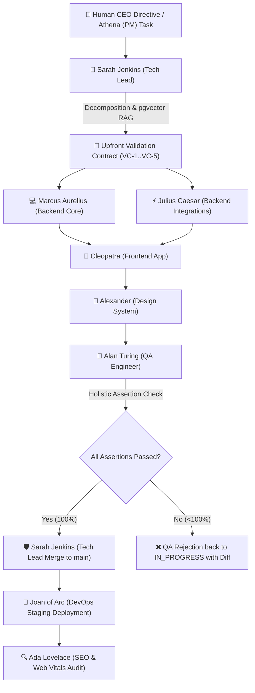

# 🏛️ TeamFlow Architecture & Multi-Agent Swarm

TeamFlow is a **Virtual Tech Company Workspace** combining a full-stack project management platform with an autonomous, multi-agent software engineering swarm powered by **NestJS 12**, **Django REST Framework**, **LangGraph**, **Google Antigravity SDK**, and **PostgreSQL + pgvector RAG**.

---

## 🏗️ High-Level System Architecture: Strangler Fig Pattern

TeamFlow implements the **Strangler Fig Pattern** to run a modern, high-throughput TypeScript REST API side-by-side with an autonomous Python AI agent swarm over a unified database:

```text
                               ┌────────────────────────────────────────────────────────┐
                               │                    👑 HUMAN CEO                        │
                               │                (ceo@teamflow.dev)                      │
                               └──────────────────────────┬─────────────────────────────┘
                                                          │ Prompts, Scope, Approvals
                                                          ▼
┌────────────────────────────────────────────────────────────────────────────────────────────────────────┐
│                                       TEAMFLOW PLATFORM                                                │
│                                                                                                        │
│   ┌──────────────────────────────────────────────────┐                                                 │
│   │             Next.js 16 App Router UI             │                                                 │
│   │   Turbopack · Tailwind CSS v4 · Lucide · Sonner  │                                                 │
│   │     Dashboard · Kanban · Pulse · Live Swarm      │                                                 │
│   └───────────────┬──────────────────────────┬───────┘                                                 │
│                   │ REST (Port 8001)         │ AI Swarm Trigger (Port 8000)                            │
│                   ▼                          ▼                                                         │
│   ┌──────────────────────────────┐     ┌───────────────────────────────────────────────────────────┐   │
│   │   NestJS Core REST Service   │     │            Python / Django AI Swarm & Workers             │   │
│   │   TypeScript · Prisma ORM    │     │   LangGraph Multi-Agent Swarm · Google Antigravity SDK    │   │
│   │   Auth · Projects · Tasks    │     │   Celery Queue Workers · Redis Pub/Sub · Vector Store     │   │
│   │   Pulse · Deployments · SEO  │     │   Author-Signed Git Commits in generated_projects/        │   │
│   └───────────────┬──────────────┘     └─────────────────────────────┬─────────────────────────────┘   │
└───────────────────┼──────────────────────────────────────────────────┼─────────────────────────────────┘
                    │                                                  │
                    │ Shared Data Access & RAG Vectors                 │
                    ▼                                                  ▼
┌────────────────────────────────────────────────────────────────────────────────────────────────────────┐
│                                   SHARED INFRASTRUCTURE & STORAGE                                      │
│                                                                                                        │
│   [( PostgreSQL 16 + pgvector )]           [( Redis 7 Cache & Queues )]          [( Keycloak 26.1 SSO )]│
│   Tables shared via Prisma @@map           Pub/Sub · Celery Broker               OAuth 2.0 & OpenID    │
│                                                                                                        │
│   [( Langfuse v4 Observability )]          [( Isolated Workspaces )]             [( Docker Compose )]  │
│   Traces with session_id=ticket-{id}       generated_projects/<id>_<slug>        Zero-Downtime Stack   │
└────────────────────────────────────────────────────────────────────────────────────────────────────────┘
```

---

## 🤖 The Canonical 9-Agent Specialist Swarm

The swarm architecture distributes responsibilities among specialized autonomous seats defined in `backend/agents/registry.py`:



---

## 📜 Upfront Validation Contracts (Factory 'Missions' Paradigm)

To guarantee software correctness and eliminate circular self-referential tests:
1. **Defined Upfront:** Before writing code, the Tech Lead / PM establishes 5+ atomic, verifiable assertions (`VC-1` to `VC-5`).
2. **Invariants & Domain Boundaries:** Explicitly defines HTTP codes, state schemas, error payloads, and accessibility standards.
3. **Independent QA Evaluation:** Alan Turing evaluates each clause against implementation code and integration test runners, calculating the **Contract Compliance Score** (`100%`).
4. **Enforced Gatekeeper:** No pull request can be merged into `main` without 100% compliance.

---

## 🔒 Dedicated Project Workspace Isolation

To prevent AI agents from ever polluting or modifying the host TeamFlow platform code:
1. **Physical Isolation:** Every user project is developed in an isolated directory (`generated_projects/<project_id>_<slug>/`).
2. **Dedicated Git Lifecycle:** Marcus Aurelius initializes a standalone Git repository (`git init -b main`).
3. **Signed Commits:** Every agent signs Git commits with their real specialist identity:
   - Backend: `Marcus Aurelius (AI) <backend1@teamflow.dev>`
   - Frontend: `Cleopatra (AI) <frontend1@teamflow.dev>`
   - Tech Lead: `Sarah Jenkins (AI) <lead@teamflow.dev>`
