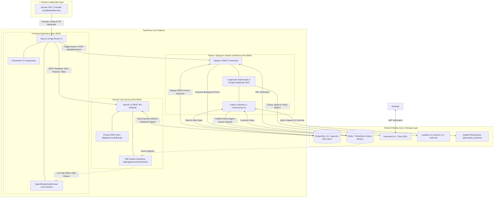
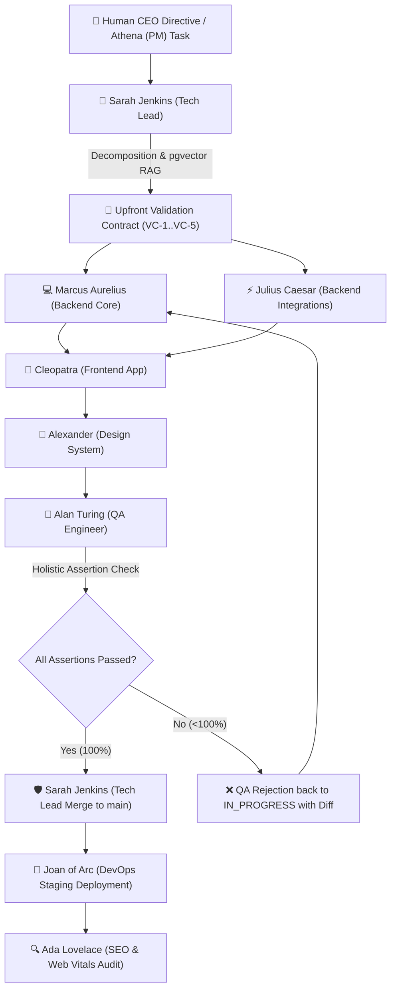
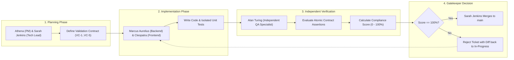
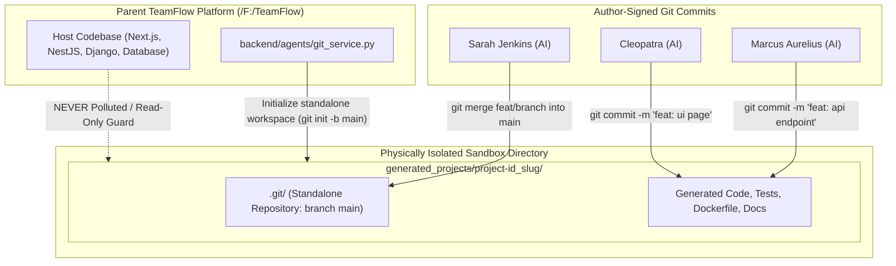
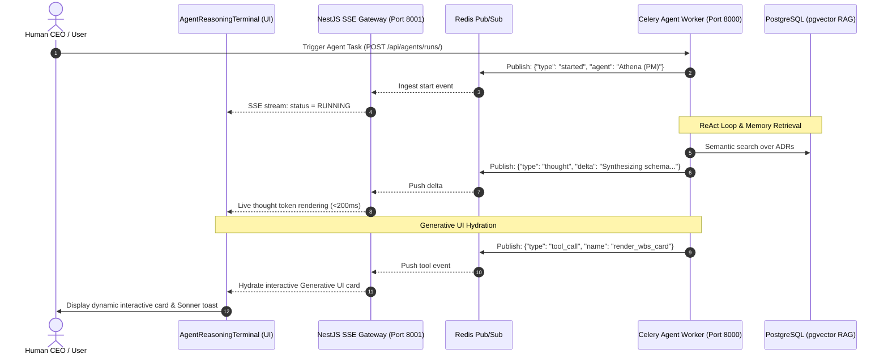
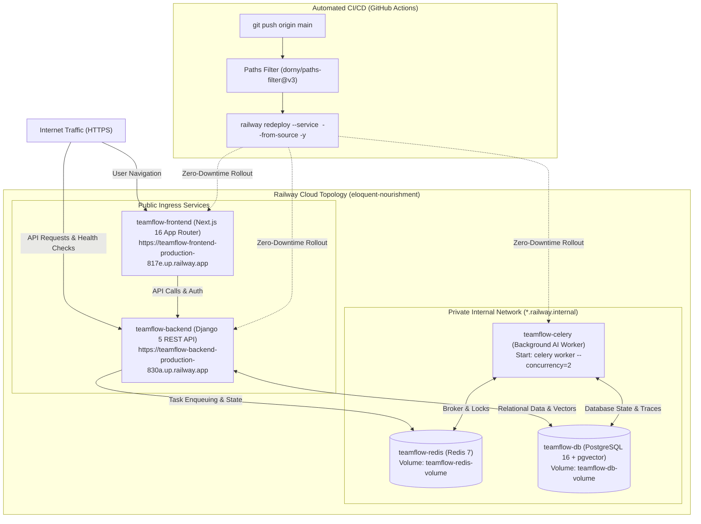

# 🏛️ TeamFlow Architecture & Multi-Agent Swarm

TeamFlow is a **Virtual Tech Company Workspace** combining a full-stack project management platform with an autonomous, multi-agent software engineering swarm powered by [NestJS 12](file:///F:/TeamFlow/backend-nest), [Django REST Framework](file:///F:/TeamFlow/backend), [LangGraph](file:///F:/TeamFlow/backend/agents/graph.py), [Google Antigravity SDK](file:///F:/TeamFlow/backend/agents/antigravity_sdk.py), and **PostgreSQL + pgvector RAG**.

> 📖 **Comprehensive Design Document:** For C4 architecture models, Strangler Fig dual-backend specifications, sandboxed Git lifecycles, and production deployment topologies, see [ARCHITECTURE_DESIGN.md](file:///F:/TeamFlow/ARCHITECTURE_DESIGN.md).

---

## 🏗️ High-Level System Architecture: Strangler Fig Pattern

TeamFlow implements the **Strangler Fig Pattern** to run a modern, high-throughput TypeScript REST API side-by-side with an autonomous Python AI agent swarm over a unified PostgreSQL database:

---

## 🤖 The Canonical 9-Agent Specialist Swarm

The swarm architecture distributes engineering responsibilities among specialized autonomous seats defined in [`backend/agents/registry.py`](file:///F:/TeamFlow/backend/agents/registry.py):

---

## 📜 Upfront Validation Contracts (Factory 'Missions' Paradigm)

To guarantee software correctness and eliminate circular self-referential tests:

1. **Defined Upfront:** Before writing code, the Tech Lead / PM establishes 5+ atomic, verifiable assertions (`VC-1` to `VC-5`).
2. **Invariants & Domain Boundaries:** Explicitly defines HTTP codes, state schemas, error payloads, and accessibility standards.
3. **Independent QA Evaluation:** Alan Turing evaluates each clause against implementation code and integration test runners, calculating the **Contract Compliance Score** (`100%`).
4. **Enforced Gatekeeper:** No pull request can be merged into `main` without 100% compliance.

---

## 🔒 Dedicated Project Workspace Isolation

To prevent AI agents from ever polluting or modifying the host TeamFlow platform code:

1. **Physical Isolation:** Every user project is developed in an isolated directory ([`generated_projects/<project_id>_<slug>/`](file:///F:/TeamFlow/backend/agents/git_service.py)).
2. **Dedicated Git Lifecycle:** Marcus Aurelius initializes a standalone Git repository (`git init -b main`).
3. **Signed Commits:** Every agent signs Git commits with their real specialist identity:
   - Backend: `Marcus Aurelius (AI) <backend1@teamflow.dev>`
   - Frontend: `Cleopatra (AI) <frontend1@teamflow.dev>`
   - Tech Lead: `Sarah Jenkins (AI) <lead@teamflow.dev>`

---

## 📡 Real-Time SSE Streaming & Generative UI Pipeline

Agent reasoning, intermediate tool executions, and generative components stream continuously with sub-200ms latency:

---

## ☁️ Production Cloud Topology on Railway

TeamFlow is architected as 5 cloud-native microservices on [Railway](https://railway.com) connected via internal private networking:

---

*© 2026 TeamFlow Core Engineering Team. Governed by the Google Antigravity SDK and the Virtual Tech Company Blueprint.*
