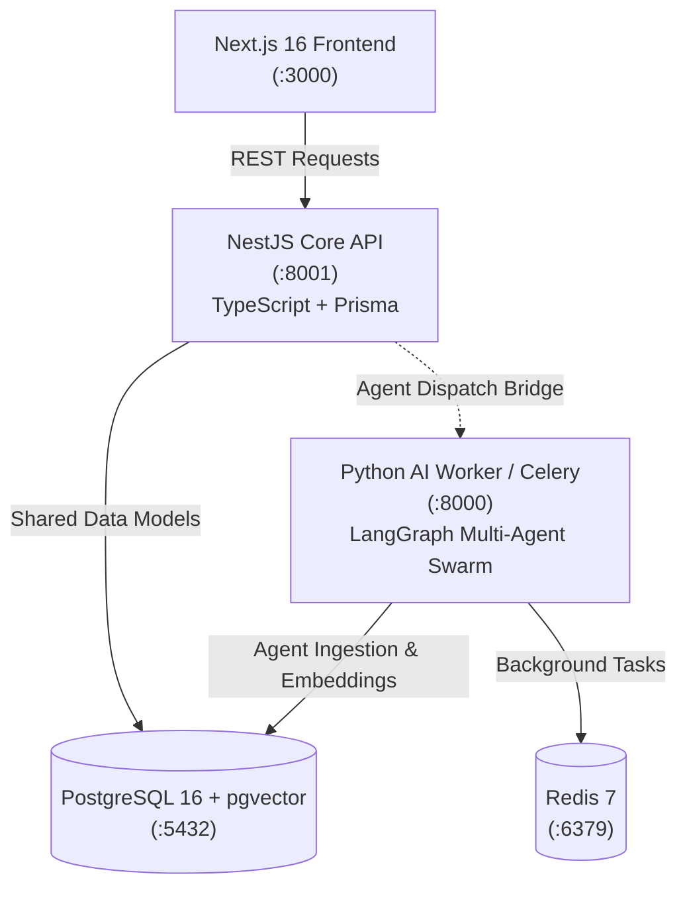

# 🏛️ TeamFlow NestJS Migration Blueprint (Strangler Fig Architecture)

**Date:** September 2026  
**Status:** Phase 1 Completed (Core REST & Business Domains Scaffolding)  
**Location:** [`backend-nest/`](file:///F:/TeamFlow/backend-nest)  

---

## 1. Architectural Strategy: Strangler Fig Pattern

Rather than a risky "big-bang" backend rewrite, TeamFlow adopts a **Hybrid Strangler Fig Architecture**:
1. **`backend-nest/`** runs as the primary high-throughput, type-safe API service for REST endpoints, business logic, and frontend interactions.
2. **`backend/` (Python/Django + LangGraph + Celery)** remains as an autonomous AI swarm and worker service.
3. Both services share the **identical PostgreSQL database (`pgvector`)**, meaning:
   - Zero downtime.
   - Zero data migration or conversion needed.
   - Existing tables (`accounts_user`, `projects_project`, `tasks_task`, etc.) are mapped with Prisma's `@@map` and `@map`.



---

## 2. Implemented Modules in `backend-nest`

| Module | Endpoints | Key Capabilities |
|---|---|---|
| **Prisma** | Database Layer | Singleton connection lifecycle, schema mapping to Django tables |
| **Auth** | `/api/auth/*` | `register`, `login`, `refresh`, `logout`, `me`, `change-password` with JWT & bcrypt |
| **Users** | `/api/users/*` | Multi-tenant member directory, role updates, open/closed task counts |
| **Projects** | `/api/projects/*` | Project CRUD, member associations, real-time completion percentages |
| **Tasks** | `/api/tasks/*`, `/api/comments/*` | 5-stage Kanban decision gate, QA validate (`done`), QA reject (`in_progress`), audit feed |
| **Pulse** | `/api/pulse/*` | Today's dashboard, private daily scratchpad note, time blocks, focus session timer |
| **Deployments** | `/api/deployments/*` | Release tracking, log stream, 1-click rollback (`revert-...`) |
| **Notifications** | `/api/notifications/*` | In-app notification feed, unread tracking, mark-all-read |
| **SEO** | `/api/seo/audits/*` | Technical SEO audit history, Core Web Vitals (FCP, LCP, CLS, FID) |
| **Billing** | `/api/billing/*` | Customer portal sessions, tier checkouts, instant mock confirmation |
| **Agents Bridge** | `/api/agents/*` | 9-agent roster status, live swarm feed, execution traces, task dispatch bridge |
| **Health & Docs** | `/api/health`, `/api/docs` | Database connectivity probe and interactive Swagger OpenAPI documentation |

---

## 3. Database Compatibility & Table Mapping

Prisma models map directly to existing PostgreSQL tables:

```prisma
datasource db {
  provider = "postgresql"
  url      = env("DATABASE_URL")
}

model Organization {
  id                   Int      @id @default(autoincrement())
  name                 String   @db.VarChar(255)
  // ...
  @@map("organizations_organization")
}

model User {
  id          Int      @id @default(autoincrement())
  email       String   @unique @db.VarChar(254)
  password    String   @db.VarChar(128)
  // ...
  @@map("accounts_user")
}

model Task {
  id         Int      @id @default(autoincrement())
  title      String   @db.VarChar(255)
  status     String   @default("todo") @db.VarChar(20)
  // ...
  @@map("tasks_task")
}
```

---

## 4. Running & Testing `backend-nest`

### Local Development
```powershell
cd f:\TeamFlow\backend-nest
npm install
npx prisma generate
npm run start:dev
```
- API Base: `http://localhost:8001/api`
- Swagger UI: `http://localhost:8001/api/docs`
- Health check: `http://localhost:8001/api/health`

### Running the Test Suite
```powershell
cd f:\TeamFlow\backend-nest
npm test
```

### Docker Compose
`backend_nest` is added to `docker-compose.yml`:
```powershell
docker compose up -d backend_nest
```

---

## 5. Switching Frontend to NestJS

In [`frontend/.env.local`](file:///F:/TeamFlow/frontend/.env.local) or [`docker-compose.yml`](file:///F:/TeamFlow/docker-compose.yml):
```env
NEXT_PUBLIC_API_URL=http://localhost:8001/api
```
All route signatures, response payloads, serialization formats, and token flows match the existing frontend expectations.
